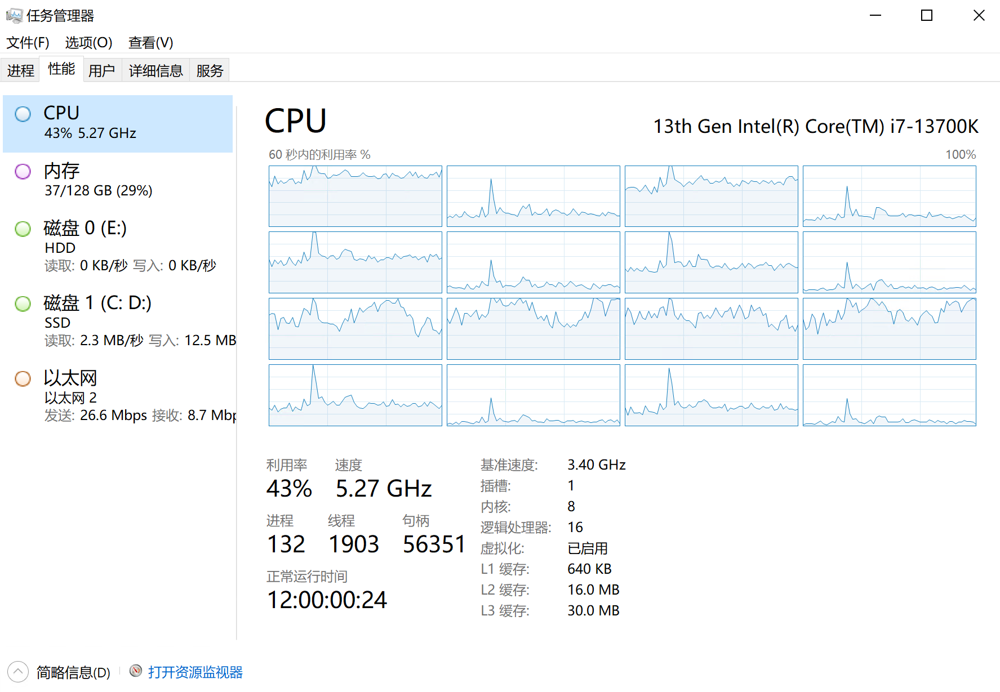

## 玩法与介绍

 
PaperCard是一个**正版**、**公益**性质的*Minecraft*服务器。

- 原版生存玩法，原汁原味生存，无经济系统，无领地保护，无边界限制（原版默认边界）。
- 多个固定出生点，死亡随机掉落，可传送（限制较大）。
- CoreProtect防熊、ChestProtect锁箱子、防止苦力怕破坏地形、原创漂流瓶等等。
- 允许生电，允许红石。
- 公益服，**无需氪金**！
- 资源共享：非共产服，属于聚落服

当前服务器版本为**1.20.1**，版本会紧跟MC版本更新。 
兼容的客户端版本为：**1.20.X**

- 服务器永久地址：`mc.paper-card.cn`
- 玩家交流QQ群：`860768366`
- 管理QQ群（有事可加，完事退群）：`822315449`

### 服务器配置
- 租用物理机，于浙江绍兴机房
- CPU：英特尔i7，13700K，5.5GHz超频水冷
- 内存：128G
- 硬盘：1T固态，2T机械
- 网络：100M上行独享带宽，玩家平均延迟50ms左右
- 运行Folia多线程核心，百人在线平均TPS20

### 目标
作为一个多人游戏的平台，致力于**增强玩家之间互动**。让玩家享受**原版的生存体验**，**从撸树开始**完成一个个成就，建造一个个建筑，直到玩腻退服退游。

### 三项基本原则
1. 玩家的建筑成果和私人财产神圣不可侵犯！
2. 坚持使用正版验证、坚持账号审核来保证玩家质量
3. 坚持原版生存玩法、版本紧跟MC版本更新

### 换挡开新周目的时机
- 只要还有人在玩（每日在线高峰不足总在线高峰的10%），不鬼服，还有钱续费，服务器就会一直开并且不换周目
- 注意MC大版本升级时一般也换周目