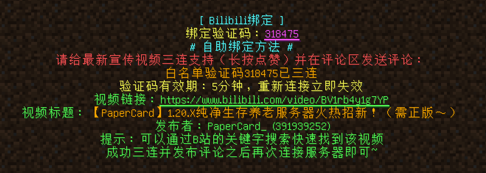
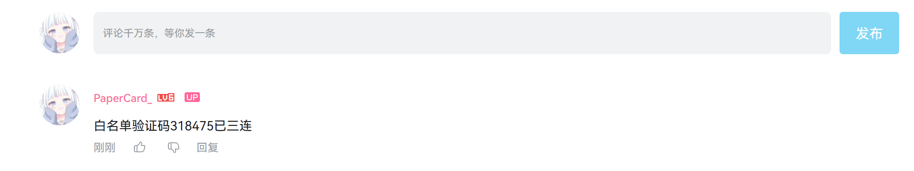
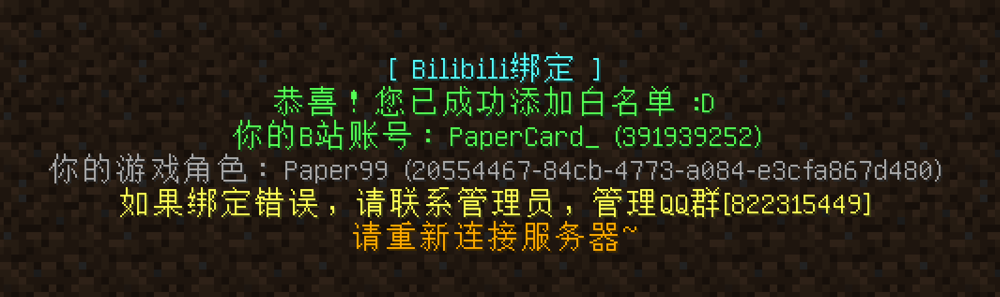
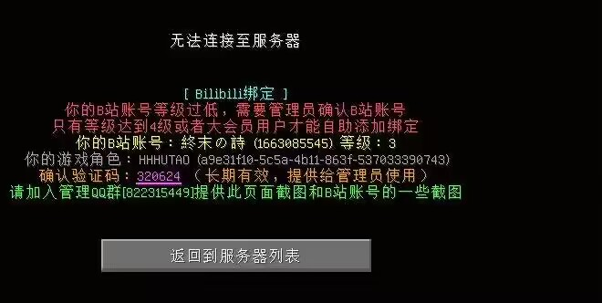
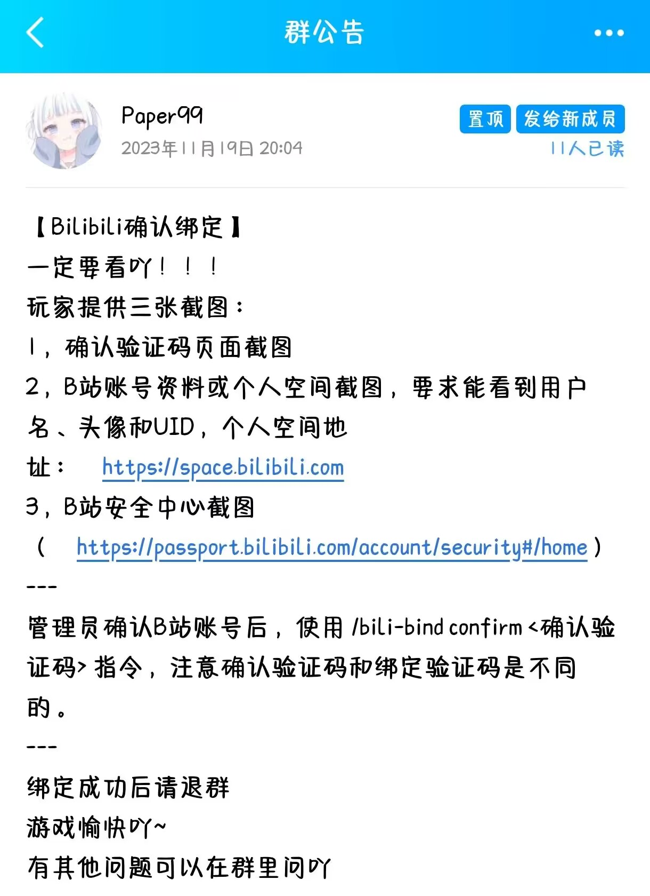

## B站账号绑定（白名单）
使用这新一代的白名单系统，主要原因是防止太多的小号来熊服（我们服务器是没有领地保护的，只有CoreProtect）。 
并且，服务器的宣传的也是主要面向B站平台的。

特点：
- 一个游戏角色一个B站账号**一对一**绑定，只有绑定B站账号才能进服。
- 等级太低的B站账号需要管理员手动核实批准才能添加白名单。

### 玩家绑定教程（正常流程）
- 第一次连接服务器（未绑定）时，会给出类似下图的提示信息（绑定验证码），提示信息以后可能会改，但按提示信息去做肯定是没问题的。 

- 在B站搜索用户**PaperCard**，一般第一个就是，点进去到个人空间：[https://space.bilibili.com/391939252](https://space.bilibili.com/391939252)。 

- 到个人空间后，按**最新发布**排序，**第一个视频**就是，直接点进去视频页面。（PS：随着新宣传视频的发布，这个视频会变成其它的，反正认准最新的就行） 

- 给视频**长按点赞三连**后，按要求发布指定评论就行，就是“白名单验证码XXXXXX已三连”，这里是“白名单验证码318475已三连”（记得要登录你的B站账号） 

- 发布评论后，再次连接服务器，会提示成功，并显示你的**游戏名**和**B站账号**，确认无误再次连接服务器就可以进去玩啦~ 

- 注意：上述步骤应该在5分钟内完成，否则验证码就失效了，需要重新连接获取最新验证码。

### 失败的可能情况
- 我找到了视频并且发布了评论，但是出现下图这种情况。这种可能的原因，图上也说了，大概率你找错视频了。 

- 他说我的B站等级不够，需要管理员确认，就像下面这张图。你需要加入管理QQ群，让管理员确认一下。 

### 玩家指令
- `bili-bind player`   查询自己的B站账号
- `bili-bind player [玩家名或UUID]`    查询指定玩家的B站账号
- `bili-bind uid <B站UID>`      根据B站UID查询绑定信息
- `bili-bind code`      生成绑定验证码
- `bili-bind check`     扫描B站的指定视频评论区，查找自己的绑定验证码进行绑定

### 管理员指令
- `bili-bind add <玩家名或UUID> <B站UID>`   为指定玩家添加B站账号绑定
- `bili-bind remove <玩家名或UUID>`     删除指定玩家的B站账号绑定
- `bili-bind bind-code <绑定验证码> <B站UID>`   通过玩家的绑定验证码为玩家添加B站账号绑定
- `bili-bind confirm <确认验证码>`      通过确认验证码为玩家添加B站账号绑定
- `bili-bind reload`        重载配置，清除缓存