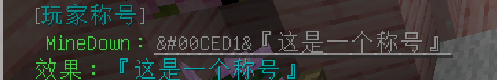
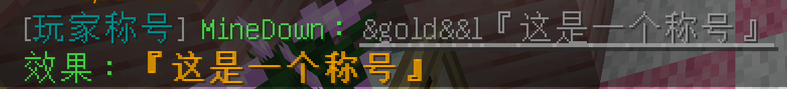
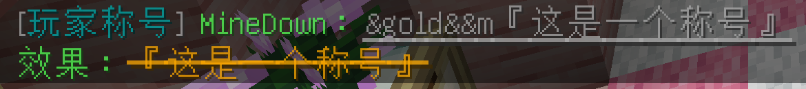
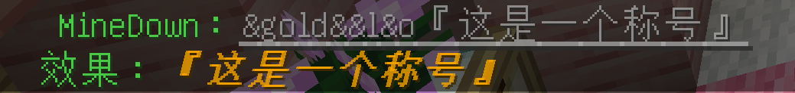
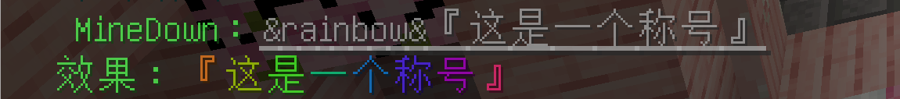
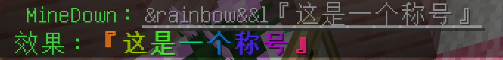
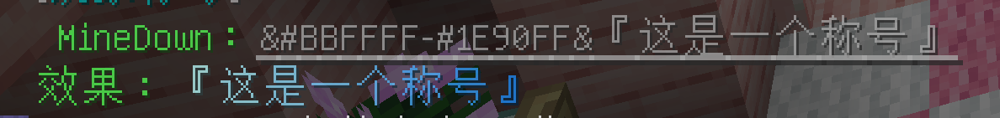
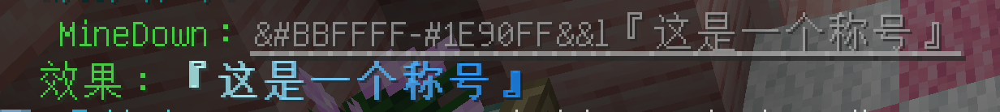

## 称号设计指南（Minedown代码指南）

### 有用的链接

- 颜色挑选：[https://www.codeeeee.com/color/rgb.html](https://www.codeeeee.com/color/rgb.html)

- 特殊符号：[https://fuhao.xiao84.com](https://fuhao.xiao84.com)

- Minedown文档：[https://github.com/Phoenix616/MineDown](https://github.com/Phoenix616/MineDown)

- 颜色名大全：[https://minecraft.wiki/w/Formatting_codes](https://minecraft.wiki/w/Formatting_codes)

- Minecraft颜色代码：

### 示例

- 单色称号（使用颜色名）：`/minedown &gold&『这是一个称号』`

- 单色称号（使用十六进制颜色代码）：`/minedown &#00CED1&『这是一个称号』`

- 单色加粗：`/minedown &gold&&l『这是一个称号』`

- 单色斜体：`/minedown &gold&&o『这是一个称号』`

- 单色删除线：`/minedown &gold&&m『这是一个称号』`

- 单色下划线：`/minedown &gold&&n『这是一个称号』`

- 单色加粗斜体：`/minedown &gold&&l&o『这是一个称号』`

- 彩虹：`/minedown &rainbow&『这是一个称号』`

- 彩虹（带相位）：`/minedown &rainbow:20&『这是一个称号』`

- 彩虹（带相位）：`/minedown &rainbow:40&『这是一个称号』`

- 彩虹加粗：`/minedown &rainbow&&l『这是一个称号』`

- 渐变：`/minedown &#BBFFFF-#1E90FF&『这是一个称号』`

- 渐变加粗：`/minedown &#BBFFFF-#1E90FF&&l『这是一个称号』`

### 说明

- 称号按月续费，使用服务器贡献值续费

- 单色：+100贡献值/月

- 彩虹：一个字符一个颜色，每一个颜色+100贡献值/月，不包括边框

- 渐变：一个字符一个颜色，每一个颜色+100贡献值/月，不包括边框

- 加样式（粗体、斜体、下划线）：每一处样式+50贡献值/月

- 边框默认统一使用“『』”

- minedown代码可用于铁砧命名物品

- 指令`/minedown <代码>`可预览代码效果

- 设计渐变称号推荐选择相近的两个颜色，由浅入深或由深入浅